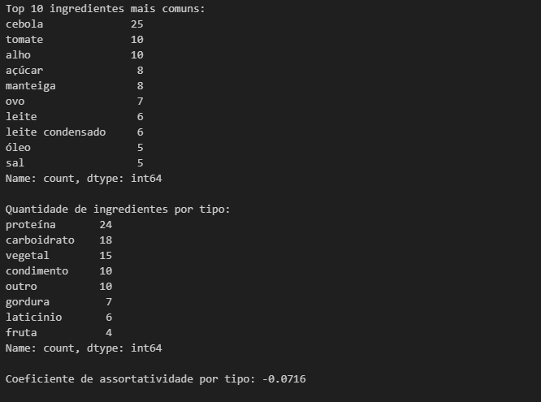
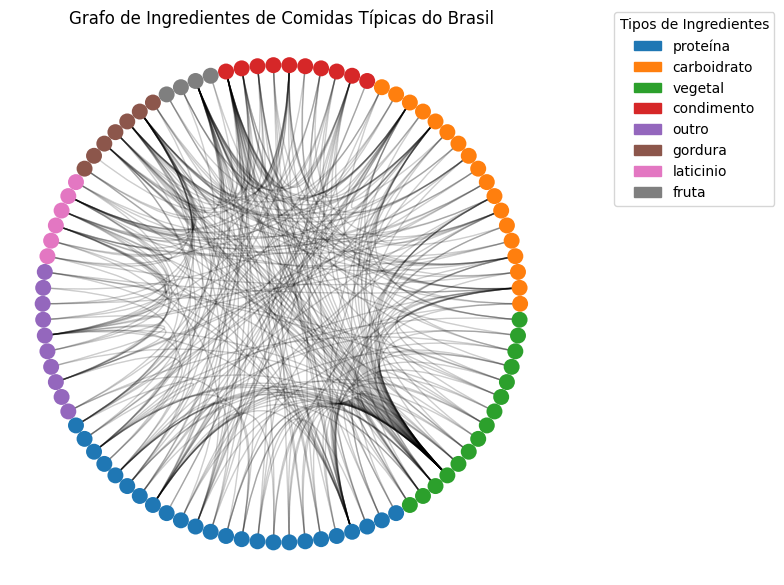

# Relatório - Tarefa 2

**Nome: Gustavo Pereira de Carvalho**  
**Matrícula: 20210039543**  
**Curso: Engenharia de Computação**  

Este relatório apresenta e discute os resultados obtidos durante a segunda tarefa da primeira unidade da disciplina de Algoritmos e Estruturas de Dados II.

## Link da apresentação: https://drive.google.com/file/d/1Q362Wdx_fad4RT1bFYbFGWRIJakYyytK/view?usp=sharing

---

A tarefa consiste na análise dos ingredientes presentes em 50 comidas típicas do Brasil, bem como sua assortatividade. Visando determinar se ocorre uma homofilia, aleatoriedade ou heterofilia na combinação dos ingredientes.

O primeiro passo foi listar 50 comidas diferentes e analisar os ingredientes de cada prato com auxílio de um modelo de linguagem LLM, nesse caso, o ChatGPT 4.0. Após isso, foi criado um arquivo CSV com colunas que organizam todas as receitas, bem como seus ingredientes e a classificação de cada ingrediente.

O arquivo CSV foi então processado utilizando um código em Python e foi criado um grafo com o auxílio da biblioteca NetworkX. O grafo se organizava de tal forma que os nós representavam os ingredientes, com atributos baseados no tipo de ingrediente, e suas arestas os ligavam a outros ingredientes que faziam parte da mesma receita.

Foi então extraído o coeficiente de assortatividade, que resultou em **-0,0716**. Um número próximo de zero e negativo, indicando maior aleatoriedade na combinação de ingredientes, porém uma tendência à heterofilia.

### Imagem da saída do programa:

---

Também foram extraídas algumas informações extras que podem ser interessantes, cuja discussão está presente no notebook Jupyter (`receitas.ipynb`). Uma visualização do grafo utilizando **CircosPlot** do `nxviz` foi criada, permitindo a observação da maior aleatoriedade na combinação de ingredientes, o que era esperado, dado o coeficiente de assortatividade de **-0,0716**.

### Imagem do Grafo Gerado:

